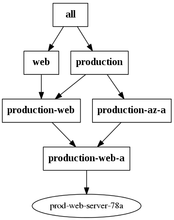

## Summary
ansible-inventory-grapher creates a dot file suitable for use by
graphviz

Requires: 
* a sensible Ansible setup (PYTHONPATH must include the Ansible libs)
* graphviz

## Usage
```
Usage: ansible-inventory-grapher [options] host1 [host2 ...]

Options:
  -h, --help       show this help message and exit
  -i INVENTORY     
  -d DIRECTORY     Location to output resulting files [current directory]
  --format=FORMAT  python format string to name output files
                   ["{hostname}.dot"]
```

Using the example inventory in https://github.com/willthames/ansible-ec2-example,
we can generate the dot files for two of the example web servers using:
```
bin/ansible-inventory-grapher -i ../ansible-ec2-example/inventory/hosts prod-web-server-78a prod-web-server-28a -d test --format "test-{hostname}.dot"
```

The resulting graphs can then be converted to pngs using:
```
for f in test/*.dot ; do dot -Tpng -o test/`basename $f .dot`.png $f; done
```

