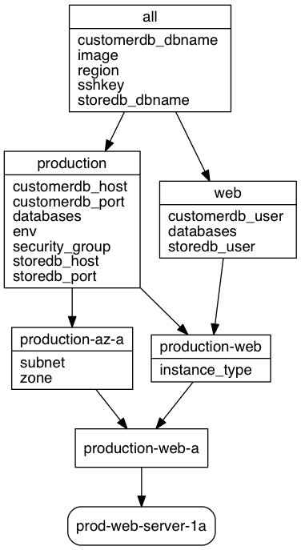

## Summary
ansible-inventory-grapher creates a dot file suitable for use by
graphviz

Requires:
* a sensible Ansible setup (PYTHONPATH must include the Ansible libs)
* graphviz

## Getting started
```
git clone http://github.com/willthames/ansible-inventory-grapher
cd ansible-inventory-grapher
export PYTHONPATH=$PYTHONPATH:`pwd`/lib
```

## Usage
```
Usage: ansible-inventory-grapher [options] pattern1 [pattern2...]

Options:
  -h, --help            show this help message and exit
  -i INVENTORY          specify inventory host file
                        [/Users/will/.ansible/hosts]
  -d DIRECTORY          Location to output resulting files [current directory]
  -o FORMAT, --format=FORMAT
                        python format string to name output files (e.g. {}.dot) 
                        [defaults to stdout]
  -q, --no-variables    Turn off variable display in default template
  -t TEMPLATE           path to jinja2 template used for creating output
  -T                    print default template
```

Using the example inventory in https://github.com/willthames/ansible-ec2-example,
we can generate the dot files for two of the example web servers using:
```
bin/ansible-inventory-grapher -i ../ansible-ec2-example/inventory/hosts prod-web-server-78a prod-web-server-28a -d test --format "test-{hostname}.dot"
```

You can replace the default template (which can be seen by passing the `-T` variable to `ansible-inventory-grapher`) with a template file that can be
passed with the `-t` option.

The resulting graphs can then be converted to pngs using:
```
for f in test/*.dot ; do dot -Tpng -o test/`basename $f .dot`.png $f; done
```



Or the whole thing can now be done in one pipeline (only works for one pattern) 
straight to image viewer (imagemagick's display in this example)
```
bin/ansible-inventory-grapher -i ../ansible-ec2-example/inventory/hosts prod-web-server-1a | dot -Tpng | display png:-
```

This works with valid Ansible patterns now although only hosts and groups have been tested.
